# Especificación de Arquitectura y Endpoints del Backend
## Proyecto: Bitácora Hidroeléctrica (Monolito Spring Boot + PostgreSQL)

---

## 1. Visión General de la Arquitectura

### 1.1. Contexto y Propósito
El backend es una aplicación monolítica REST construida con **Java 17+ (o Java 21)**, **Spring Boot 3.x**, **Spring Data JPA / Hibernate**, **Spring Security con JWT** y **PostgreSQL**.
Su objetivo es reemplazar el registro manual en hojas de cálculo por una plataforma centralizada, transaccional y auditable que sirva a la aplicación Single Page Application (React + TypeScript + Tailwind CSS).

### 1.2. Principios de Diseño
* **Monolito Modular:** Todo el dominio (autenticación, lecturas horarias, cálculos matemáticos derivados, auditoría, gestión de turnos y generación de PDF) reside en un único artefacto desplegable.
* **Fuente Única de Verdad (Single Source of Truth):** Las 47 variables (44 lecturas manuales + 3 calculadas) se persisten y recalculan en el servidor para evitar discrepancias por cálculos en el cliente.
* **Separación de Capas y DTOs Estrictos:** Ninguna entidad JPA de base de datos se expone directamente en los controladores; toda la interacción con el frontend se realiza mediante Data Transfer Objects (DTOs) validados con `jakarta.validation`.
* **Idioma:** Identificadores en código (clases, métodos, variables, tablas, endpoints) en **inglés**; mensajes de validación, logs de negocio y contenido visible al usuario en **español**.
* **Auditoría Obligatoria y Trazabilidad:** Cualquier mutación sobre una hora previamente guardada (`saved = true`) exige justificación mínima de 10 caracteres y registra un diff atómico por cada campo modificado.

---

## 2. Modelo de Datos Relacional (PostgreSQL)

El modelo está diseñado para almacenar las lecturas de las 24 horas del día con alta eficiencia, asegurando integridad referencial, índices para consultas en tiempo real y bloqueo optimista o restricciones de unicidad para evitar condiciones de carrera.

```mermaid
erDiagram
    USERS ||--o{ DAILY_REPORTS : "creates"
    USERS ||--o{ AUDIT_LOGS : "performs_action"
    USERS ||--o{ SHIFT_HANDOFFS : "delivers_or_receives"
    DAILY_REPORTS ||--|{ HOURLY_READINGS : "contains (24 hours)"
    HOURLY_READINGS ||--o{ AUDIT_LOGS : "triggers_audit"

    USERS {
        BIGSERIAL id PK
        VARCHAR username UK
        VARCHAR password_hash
        VARCHAR full_name
        VARCHAR role "ADMIN, OPERATOR"
        VARCHAR shift "Turno A, Turno B"
        BOOLEAN active
        TIMESTAMP created_at
        TIMESTAMP updated_at
    }

    DAILY_REPORTS {
        BIGSERIAL id PK
        DATE report_date UK
        BIGINT created_by FK
        VARCHAR status "OPEN, CLOSED"
        TIMESTAMP created_at
        TIMESTAMP updated_at
    }

    HOURLY_READINGS {
        BIGSERIAL id PK
        BIGINT daily_report_id FK
        INT hour "0 to 23"
        BOOLEAN saved
        BOOLEAN is_edited
        TEXT observations
        DOUBLE_PRECISION nivel_carga
        DOUBLE_PRECISION nivel_descarga
        DOUBLE_PRECISION serv_aux_kwh
        DOUBLE_PRECISION epsa_actaris_kwh
        DOUBLE_PRECISION gen_bruta_kwh
        DOUBLE_PRECISION pot_activa_g1
        DOUBLE_PRECISION volt_exc_g1
        DOUBLE_PRECISION corr_exc_g1
        DOUBLE_PRECISION volt_g1_rst
        DOUBLE_PRECISION corr_g1_fase_r
        DOUBLE_PRECISION corr_g1_fase_s
        DOUBLE_PRECISION corr_g1_fase_t
        DOUBLE_PRECISION cont_actaris_g1
        DOUBLE_PRECISION kwh_g1
        DOUBLE_PRECISION temp_trafo_f1
        DOUBLE_PRECISION temp_trafo_f2
        DOUBLE_PRECISION temp_trafo_f3
        DOUBLE_PRECISION temp_g1_coj_exc
        DOUBLE_PRECISION temp_g1_salida_aire
        DOUBLE_PRECISION temp_g1_entrada_aire
        DOUBLE_PRECISION temp_g1_coj_acoplado
        DOUBLE_PRECISION temp_g1_coj_no_acoplado
        DOUBLE_PRECISION temp_g1_coj_empuje
        DOUBLE_PRECISION temp_g1_aceite
        DOUBLE_PRECISION temp_g1_salida_aire_exc
        DOUBLE_PRECISION pot_activa_g2
        DOUBLE_PRECISION volt_exc_g2
        DOUBLE_PRECISION corr_exc_g2
        DOUBLE_PRECISION volt_g2_rst
        DOUBLE_PRECISION corr_g2_fase_r
        DOUBLE_PRECISION corr_g2_fase_s
        DOUBLE_PRECISION corr_g2_fase_t
        DOUBLE_PRECISION temp_coj_guia_g2
        DOUBLE_PRECISION temp_coj_acoplado_t2
        DOUBLE_PRECISION cont_actaris_g2
        DOUBLE_PRECISION kwh_g2
        DOUBLE_PRECISION temp_g2_coj_exc
        DOUBLE_PRECISION temp_g2_salida_aire
        DOUBLE_PRECISION temp_g2_entrada_aire
        DOUBLE_PRECISION temp_g2_coj_acoplado
        DOUBLE_PRECISION temp_g2_coj_no_acoplado
        DOUBLE_PRECISION temp_g2_coj_empuje
        DOUBLE_PRECISION temp_g2_aceite
        DOUBLE_PRECISION temp_g2_nucleo_estator
        DOUBLE_PRECISION temp_g2_estator_fase_u
        DOUBLE_PRECISION temp_g2_estator_fase_v
        DOUBLE_PRECISION temp_g2_estator_fase_w
        BIGINT last_modified_by FK
        TIMESTAMP created_at
        TIMESTAMP updated_at
    }

    AUDIT_LOGS {
        BIGSERIAL id PK
        BIGINT hourly_reading_id FK
        BIGINT user_id FK
        DATE report_date
        INT hour
        VARCHAR field_key
        VARCHAR field_label
        VARCHAR old_value
        VARCHAR new_value
        TEXT justification
        TIMESTAMP created_at
    }

    SHIFT_HANDOFFS {
        BIGSERIAL id PK
        DATE report_date
        INT hour
        VARCHAR shift_type "A, B"
        BIGINT delivering_user_id FK
        BIGINT receiving_user_id FK
        TEXT notes
        TIMESTAMP created_at
    }
```



### 2.1. Script DDL Inicial (PostgreSQL)

```sql
-- Tablas principales del sistema de bitácora

CREATE TABLE users (
    id BIGSERIAL PRIMARY KEY,
    username VARCHAR(50) NOT NULL UNIQUE,
    password_hash VARCHAR(255) NOT NULL,
    full_name VARCHAR(120) NOT NULL,
    role VARCHAR(20) NOT NULL CHECK (role IN ('ROLE_ADMIN', 'ROLE_OPERATOR')),
    shift VARCHAR(50),
    active BOOLEAN NOT NULL DEFAULT TRUE,
    created_at TIMESTAMP WITH TIME ZONE DEFAULT CURRENT_TIMESTAMP,
    updated_at TIMESTAMP WITH TIME ZONE DEFAULT CURRENT_TIMESTAMP
);

CREATE TABLE daily_reports (
    id BIGSERIAL PRIMARY KEY,
    report_date DATE NOT NULL UNIQUE,
    created_by BIGINT REFERENCES users(id),
    status VARCHAR(20) NOT NULL DEFAULT 'OPEN' CHECK (status IN ('OPEN', 'CLOSED')),
    created_at TIMESTAMP WITH TIME ZONE DEFAULT CURRENT_TIMESTAMP,
    updated_at TIMESTAMP WITH TIME ZONE DEFAULT CURRENT_TIMESTAMP
);

CREATE TABLE hourly_readings (
    id BIGSERIAL PRIMARY KEY,
    daily_report_id BIGINT NOT NULL REFERENCES daily_reports(id) ON DELETE CASCADE,
    hour INT NOT NULL CHECK (hour >= 0 AND hour <= 23),
    saved BOOLEAN NOT NULL DEFAULT FALSE,
    is_edited BOOLEAN NOT NULL DEFAULT FALSE,
    observations TEXT,

    -- B, C: Hidráulico
    nivel_carga NUMERIC(10, 2),
    nivel_descarga NUMERIC(10, 2),

    -- D, E, F: Medición Frontera
    serv_aux_kwh NUMERIC(12, 2),
    epsa_actaris_kwh NUMERIC(14, 3),
    gen_bruta_kwh NUMERIC(14, 2),

    -- G-M: G-1 Eléctrico
    pot_activa_g1 NUMERIC(10, 2),
    volt_exc_g1 NUMERIC(10, 2),
    corr_exc_g1 NUMERIC(10, 2),
    volt_g1_rst NUMERIC(10, 2),
    corr_g1_fase_r NUMERIC(10, 2),
    corr_g1_fase_s NUMERIC(10, 2),
    corr_g1_fase_t NUMERIC(10, 2),

    -- N, O: Medición G-1
    cont_actaris_g1 NUMERIC(14, 3),
    kwh_g1 NUMERIC(14, 2),

    -- P, Q, R: Transformador 1.500 KVA
    temp_trafo_f1 NUMERIC(6, 2),
    temp_trafo_f2 NUMERIC(6, 2),
    temp_trafo_f3 NUMERIC(6, 2),

    -- S-Z: Temperaturas G-1
    temp_g1_coj_exc NUMERIC(6, 2),
    temp_g1_salida_aire NUMERIC(6, 2),
    temp_g1_entrada_aire NUMERIC(6, 2),
    temp_g1_coj_acoplado NUMERIC(6, 2),
    temp_g1_coj_no_acoplado NUMERIC(6, 2),
    temp_g1_coj_empuje NUMERIC(6, 2),
    temp_g1_aceite NUMERIC(6, 2),
    temp_g1_salida_aire_exc NUMERIC(6, 2),

    -- AC-AI: G-2 Eléctrico
    pot_activa_g2 NUMERIC(10, 2),
    volt_exc_g2 NUMERIC(10, 2),
    corr_exc_g2 NUMERIC(10, 2),
    volt_g2_rst NUMERIC(10, 2),
    corr_g2_fase_r NUMERIC(10, 2),
    corr_g2_fase_s NUMERIC(10, 2),
    corr_g2_fase_t NUMERIC(10, 2),

    -- AJ, AK: Mecánico G-2
    temp_coj_guia_g2 NUMERIC(6, 2),
    temp_coj_acoplado_t2 NUMERIC(6, 2),

    -- AL, AM: Medición G-2
    cont_actaris_g2 NUMERIC(14, 3),
    kwh_g2 NUMERIC(14, 2),

    -- AN-AT: Temperaturas G-2
    temp_g2_coj_exc NUMERIC(6, 2),
    temp_g2_salida_aire NUMERIC(6, 2),
    temp_g2_entrada_aire NUMERIC(6, 2),
    temp_g2_coj_acoplado NUMERIC(6, 2),
    temp_g2_coj_no_acoplado NUMERIC(6, 2),
    temp_g2_coj_empuje NUMERIC(6, 2),
    temp_g2_aceite NUMERIC(6, 2),

    -- AU-AX: Estator G-2
    temp_g2_nucleo_estator NUMERIC(6, 2),
    temp_g2_estator_fase_u NUMERIC(6, 2),
    temp_g2_estator_fase_v NUMERIC(6, 2),
    temp_g2_estator_fase_w NUMERIC(6, 2),

    last_modified_by BIGINT REFERENCES users(id),
    created_at TIMESTAMP WITH TIME ZONE DEFAULT CURRENT_TIMESTAMP,
    updated_at TIMESTAMP WITH TIME ZONE DEFAULT CURRENT_TIMESTAMP,

    CONSTRAINT uq_daily_report_hour UNIQUE (daily_report_id, hour)
);

CREATE TABLE audit_logs (
    id BIGSERIAL PRIMARY KEY,
    hourly_reading_id BIGINT REFERENCES hourly_readings(id) ON DELETE SET NULL,
    user_id BIGINT NOT NULL REFERENCES users(id),
    report_date DATE NOT NULL,
    hour INT NOT NULL,
    field_key VARCHAR(50) NOT NULL,
    field_label VARCHAR(100) NOT NULL,
    old_value VARCHAR(100),
    new_value VARCHAR(100) NOT NULL,
    justification TEXT NOT NULL,
    created_at TIMESTAMP WITH TIME ZONE DEFAULT CURRENT_TIMESTAMP
);

CREATE TABLE shift_handoffs (
    id BIGSERIAL PRIMARY KEY,
    report_date DATE NOT NULL,
    hour INT NOT NULL,
    shift_type VARCHAR(10) NOT NULL,
    delivering_user_id BIGINT NOT NULL REFERENCES users(id),
    receiving_user_id BIGINT NOT NULL REFERENCES users(id),
    notes TEXT,
    created_at TIMESTAMP WITH TIME ZONE DEFAULT CURRENT_TIMESTAMP
);

-- Índices de consulta frecuente
CREATE INDEX idx_daily_reports_date ON daily_reports(report_date);
CREATE INDEX idx_hourly_readings_report_hour ON hourly_readings(daily_report_id, hour);
CREATE INDEX idx_audit_logs_date_hour ON audit_logs(report_date, hour);
CREATE INDEX idx_audit_logs_user ON audit_logs(user_id);
```

---

## 3. Diccionario Completo de Variables (47 Columnas de Planta)

A continuación se detalla la correlación exacta entre:
1. **Clave TypeScript Frontend** (`HourlyReading` en `types.ts`).
2. **Propiedad Java DTO y Entidad** (`HourlyReadingDTO.java` y `HourlyReading.java`).
3. **Columna en Base de Datos PostgreSQL**.
4. **Etiqueta, Unidad, Grupo Operativo y Tipo de Entrada**.

| Columna Excel | Clave Frontend / DTO Java | Columna BD PostgreSQL | Etiqueta UI | Unidad | Grupo | Tipo de Campo | Regla / Fórmula de Cálculo |
| :---: | :--- | :--- | :--- | :---: | :--- | :---: | :--- |
| **B** | `nivelCarga` | `nivel_carga` | Niv. Carga | msnm | Hidráulico | Manual | Directo (Ej. limnímetro) |
| **C** | `nivelDescarga` | `nivel_descarga` | Niv. Descarga | msnm | Hidráulico | Manual | Directo |
| **D** | `servAuxKwh` | `serv_aux_kwh` | Serv. Aux | kWh | Med. Frontera | Manual | Lectura acumulativa contador |
| **E** | `epsaActarisKwh` | `epsa_actaris_kwh` | EPSA Actaris | kWh | Med. Frontera | Manual | Lectura acumulativa frontera |
| **F** | `genBrutaKwh` | `gen_bruta_kwh` | Gen. Bruta | kWh | Med. Frontera | **Calculado** | $(E_{t} - E_{t-1}) \times 2400$ |
| **G** | `potActivaG1` | `pot_activa_g1` | Pot. Activa | kW | G-1 Eléctrico | Manual | Potencia instantánea G1 |
| **H** | `voltExcG1` | `volt_exc_g1` | V. Excit. | V | G-1 Eléctrico | Manual | Voltaje excitación G1 |
| **I** | `corrExcG1` | `corr_exc_g1` | I. Excit. | A | G-1 Eléctrico | Manual | Corriente excitación G1 |
| **J** | `voltG1rst` | `volt_g1_rst` | V. RST | V | G-1 Eléctrico | Manual | Voltaje de línea RST G1 |
| **K** | `corrG1faseR` | `corr_g1_fase_r` | I. Fase R | A | G-1 Eléctrico | Manual | Corriente Fase R G1 |
| **L** | `corrG1faseS` | `corr_g1_fase_s` | I. Fase S | A | G-1 Eléctrico | Manual | Corriente Fase S G1 |
| **M** | `corrG1faseT` | `corr_g1_fase_t` | I. Fase T | A | G-1 Eléctrico | Manual | Corriente Fase T G1 |
| **N** | `contActarisG1` | `cont_actaris_g1` | Cont. Actaris | kWh | Med. G-1 | Manual | Contador Actaris generador 1 |
| **O** | `kwhG1` | `kwh_g1` | KWH G-1 | kWh | Med. G-1 | **Calculado** | $(N_{t} - N_{t-1}) \times 1363.63$ |
| **P** | `tempTrafoF1` | `temp_trafo_f1` | Trafo F1 | °C | Transformador | Manual | Transformador 1.500 KVA F1 |
| **Q** | `tempTrafoF2` | `temp_trafo_f2` | Trafo F2 | °C | Transformador | Manual | Transformador 1.500 KVA F2 |
| **R** | `tempTrafoF3` | `temp_trafo_f3` | Trafo F3 | °C | Transformador | Manual | Transformador 1.500 KVA F3 |
| **S** | `tempG1CojExc` | `temp_g1_coj_exc` | Coj. Excit. | °C | Temp. G-1 | Manual | Cojinete excitación G1 |
| **T** | `tempG1SalidaAire` | `temp_g1_salida_aire` | Sal. Aire | °C | Temp. G-1 | Manual | Salida de aire G1 |
| **U** | `tempG1EntradaAire`| `temp_g1_entrada_aire`| Ent. Aire | °C | Temp. G-1 | Manual | Entrada de aire G1 |
| **V** | `tempG1CojAcoplado`| `temp_g1_coj_acoplado`| Coj. Acop. | °C | Temp. G-1 | Manual | Cojinete acoplado G1 |
| **W** | `tempG1CojNoAcoplado`| `temp_g1_coj_no_acoplado`| Coj. No Ac. | °C | Temp. G-1 | Manual | Cojinete no acoplado G1 |
| **X** | `tempG1CojEmpuje` | `temp_g1_coj_empuje` | Coj. Empuje | °C | Temp. G-1 | Manual | Cojinete de empuje G1 |
| **Y** | `tempG1Aceite` | `temp_g1_aceite` | Aceite Cuba | °C | Temp. G-1 | Manual | Aceite cuba G1 |
| **Z** | `tempG1SalidaAireExc`| `temp_g1_salida_aire_exc`| Sal. Aire Exc. | °C | Temp. G-1 | Manual | Salida aire excitación G1 |
| **AC**| `potActivaG2` | `pot_activa_g2` | Pot. Activa | kW | G-2 Eléctrico | Manual | Potencia instantánea G2 |
| **AD**| `voltExcG2` | `volt_exc_g2` | V. Excit. | V | G-2 Eléctrico | Manual | Voltaje excitación G2 |
| **AE**| `corrExcG2` | `corr_exc_g2` | I. Excit. | A | G-2 Eléctrico | Manual | Corriente excitación G2 |
| **AF**| `voltG2rst` | `volt_g2_rst` | V. RST | V | G-2 Eléctrico | Manual | Voltaje línea RST G2 |
| **AG**| `corrG2faseR` | `corr_g2_fase_r` | I. Fase R | A | G-2 Eléctrico | Manual | Corriente Fase R G2 |
| **AH**| `corrG2faseS` | `corr_g2_fase_s` | I. Fase S | A | G-2 Eléctrico | Manual | Corriente Fase S G2 |
| **AI**| `corrG2faseT` | `corr_g2_fase_t` | I. Fase T | A | G-2 Eléctrico | Manual | Corriente Fase T G2 |
| **AJ**| `tempCojGuiaG2` | `temp_coj_guia_g2` | Coj. Guía G2 | °C | Mecánico G-2 | Manual | Cojinete guía G2 |
| **AK**| `tempCojAcopladoT2`| `temp_coj_acoplado_t2`| Coj. Acop. T2 | °C | Mecánico G-2 | Manual | Cojinete acoplado T2 |
| **AL**| `contActarisG2` | `cont_actaris_g2` | Cont. Actaris | kWh | Med. G-2 | Manual | Contador Actaris generador 2 |
| **AM**| `kwhG2` | `kwh_g2` | KWH G-2 | kWh | Med. G-2 | **Calculado** | $(AL_{t} - AL_{t-1}) \times 1363.63$ |
| **AN**| `tempG2CojExc` | `temp_g2_coj_exc` | Coj. Excit. | °C | Temp. G-2 | Manual | Cojinete excitación G2 |
| **AO**| `tempG2SalidaAire` | `temp_g2_salida_aire` | Sal. Aire | °C | Temp. G-2 | Manual | Salida aire G2 |
| **AP**| `tempG2EntradaAire`| `temp_g2_entrada_aire`| Ent. Aire | °C | Temp. G-2 | Manual | Entrada aire G2 |
| **AQ**| `tempG2CojAcoplado`| `temp_g2_coj_acoplado`| Coj. Acop. | °C | Temp. G-2 | Manual | Cojinete acoplado G2 |
| **AR**| `tempG2CojNoAcoplado`| `temp_g2_coj_no_acoplado`| Coj. No Ac. | °C | Temp. G-2 | Manual | Cojinete no acoplado G2 |
| **AS**| `tempG2CojEmpuje` | `temp_g2_coj_empuje` | Coj. Empuje | °C | Temp. G-2 | Manual | Cojinete de empuje G2 |
| **AT**| `tempG2Aceite` | `temp_g2_aceite` | Aceite Cuba | °C | Temp. G-2 | Manual | Aceite cuba G2 |
| **AU**| `tempG2NucleoEstator`| `temp_g2_nucleo_estator`| Núcleo Est. | °C | Estator G-2 | Manual | Temperatura núcleo estátor G2 |
| **AV**| `tempG2EstatorFaseU`| `temp_g2_estator_fase_u`| Est. Fase U | °C | Estator G-2 | Manual | Temperatura estátor Fase U G2 |
| **AW**| `tempG2EstatorFaseV`| `temp_g2_estator_fase_v`| Est. Fase V | °C | Estator G-2 | Manual | Temperatura estátor Fase V G2 |
| **AX**| `tempG2EstatorFaseW`| `temp_g2_estator_fase_w`| Est. Fase W | °C | Estator G-2 | Manual | Temperatura estátor Fase W G2 |

---

## 4. Reglas de Negocio y Lógica Crítica

### 4.1. Regla de Datos Faltantes (RF-3)
* Un operador puede guardar una hora dejando campos numéricos vacíos (`null` o string vacío en frontend).
* **Condición de Rechazo:** Si existe al menos **1** campo manual vacío entre los 44 editables y el campo `observations` viene nulo o con longitud menor a 3 caracteres, el backend **rechaza la petición con HTTP 400 Bad Request** indicando:
  `"Debe justificar en las observaciones el motivo por el cual hay campos de lectura sin registrar."`

### 4.2. Regla de Auditoría en Modificaciones (RF-4)
* Cuando una hora ya fue guardada previamente (`saved == true`):
  * Toda petición de actualización vía `PUT` requiere obligatoriamente el atributo `justification`.
  * `justification` debe tener una longitud de **al menos 10 caracteres**.
  * El servicio backend compara cada campo numérico entrante con el valor actual en la BD.
  * Por cada campo que cambie de valor:
    * Se genera una fila en `audit_logs` con `field_key`, `field_label`, `old_value`, `new_value`, `justification`, fecha, hora y el ID del operador autenticado.
  * La lectura se marca con `is_edited = true`.

### 4.3. Regla de Cálculos en Cascada y Continuidad
* **Caso Base (Hora 0 / 00:00):**
  Para calcular los diferenciales $(E_{0} - E_{-1})$, el sistema consulta la lectura de las **23:00 del día anterior** (`report_date - 1`). Si no existe lectura del día anterior, el delta es 0 o se toma como lectura inicial de contador.
* **Recálculo en Cascada:**
  Si un operador edita el valor de `epsaActarisKwh`, `contActarisG1` o `contActarisG2` de la hora $h$:
  1. Se recalcula `genBrutaKwh`, `kwhG1` y `kwhG2` para la hora $h$.
  2. Si la hora subsiguiente $h+1$ ya estaba guardada en el sistema, se recalculan automáticamente sus métricas derivadas en esa misma transacción para mantener la consistencia matemática.

### 4.4. Regla de Control de Operador en Turno Rotativo (RF-5)
* Debido a los turnos rotativos en la central hidroeléctrica (Turno A: 06:00–18:00, Turno B: 18:00–06:00), la facultad para registrar o modificar lecturas operativas hora a hora pertenece de forma exclusiva al operador que ostenta la guardia activa.
* **Determinación del Operador en Turno:**
  * Se obtiene a través del último relevo registrado en la tabla `shift_handoffs` (`findTopByOrderByCreatedAtDesc`).
  * El usuario receptor (`receiving_user_id`) del último relevo es el operador en turno activo.
  * Si no existen registros de relevo, se toma el operador activo por defecto inicializado en el sistema.
* **Restricción de Registro y Modificación:**
  * Al invocar `POST /api/v1/daily-reports/{date}/readings` o `PUT /api/v1/daily-reports/{date}/readings/{hour}`:
    * Si el usuario autenticado es un operador (`ROLE_OPERATOR`) y su ID no coincide con el del operador en turno activo, el backend rechaza la operación arrojando una `BusinessRuleException` con mensaje explicativo:
      `"No está autorizado para registrar lecturas: el turno le pertenece a [Nombre del Operador en Turno]. Solo el operador en turno activo puede registrar o modificar lecturas."`
    * Los usuarios con rol `ROLE_ADMIN` conservan permisos de supervisión.
* **Entrega de Turno (Relevo):**
  * Solo el operador actualmente en turno (o un administrador) puede ejecutar `POST /api/v1/shifts/handoff`.
  * No se permite realizar entrega de turno a uno mismo.
  * Al confirmar el relevo, la custodia operativa se transfiere inmediatamente al nuevo operador receptor, inhabilitando al operador saliente para registrar nuevas horas.

---

## 5. Especificación Exhaustiva de Endpoints REST

Prefijo global de la API: `/api/v1`

```
├── /auth
│   ├── POST   /login                       -> Autenticación y obtención de JWT
│   └── GET    /me                          -> Perfil del usuario en sesión
├── /users                                  [ROLE_ADMIN]
│   ├── GET    /                            -> Listar usuarios del sistema
│   ├── POST   /                            -> Registrar nuevo usuario
│   ├── PUT    /{id}                        -> Actualizar datos de usuario
│   └── PATCH  /{id}/toggle-status          -> Activar / Desactivar usuario
├── /daily-reports
│   ├── GET    ?date=YYYY-MM-DD             -> Consultar día completo (24 horas)
│   ├── POST   /{date}/readings             -> Registrar lectura de una hora
│   ├── PUT    /{date}/readings/{hour}      -> Modificar hora (con justificación)
│   └── GET    /{date}/export/pdf           -> Descargar reporte formal PDF
├── /audit-logs                             [ROLE_ADMIN, ROLE_OPERATOR]
│   └── GET    ?date=&operator=&field=      -> Consultar registros de auditoría
├── /shifts
│   ├── POST   /handoff                     -> Registrar entrega de turno
│   └── GET    /current                     -> Turno operativo activo
└── /dashboard
    └── GET    /metrics?date=YYYY-MM-DD     -> KPIs para monitor y panel admin
```

---

### 5.1. Módulo de Autenticación (`/api/v1/auth`)

#### `POST /api/v1/auth/login`
Autentica credenciales y devuelve el token JWT con los datos de perfil y turno del usuario.
* **Seguridad:** Público (sin autenticación previa).
* **Request Body:**
```json
{
  "username": "c.mendoza",
  "password": "Password123!"
}
```
* **Response 200 OK:**
```json
{
  "token": "eyJhbGciOiJIUzI1NiIsInR5cCI6IkpXVCJ9...",
  "tokenType": "Bearer",
  "expiresIn": 28800,
  "user": {
    "id": 2,
    "name": "Carlos Mendoza",
    "username": "c.mendoza",
    "role": "operador",
    "active": true,
    "shift": "Turno A (06:00–18:00)"
  }
}
```
* **Errores Posibles:**
  * `401 Unauthorized`: `"Credenciales inválidas. Verifique su usuario y contraseña."`
  * `403 Forbidden`: `"El usuario se encuentra inactivo en el sistema. Contacte al administrador."`

---

#### `GET /api/v1/auth/me`
Obtiene los datos del usuario asociado al token actual.
* **Seguridad:** Requiere header `Authorization: Bearer <token>`.
* **Response 200 OK:**
```json
{
  "id": 2,
  "name": "Carlos Mendoza",
  "username": "c.mendoza",
  "role": "operador",
  "active": true,
  "shift": "Turno A (06:00–18:00)"
}
```

---

### 5.2. Módulo de Gestión de Usuarios (`/api/v1/users`)
*Consumido por `UserModal.tsx` en el panel de administrador.*
* **Seguridad:** Requiere rol `ROLE_ADMIN`.

#### `GET /api/v1/users`
Lista todos los usuarios registrados en el sistema.
* **Response 200 OK:**
```json
[
  {
    "id": 1,
    "nombre": "Administrador Sistema",
    "usuario": "admin",
    "rol": "admin",
    "activo": true,
    "turno": null
  },
  {
    "id": 2,
    "nombre": "Carlos Mendoza",
    "usuario": "c.mendoza",
    "rol": "operador",
    "activo": true,
    "turno": "Turno A (06:00–18:00)"
  },
  {
    "id": 5,
    "nombre": "Diana Castillo",
    "usuario": "d.castillo",
    "rol": "operador",
    "activo": false,
    "turno": "—"
  }
]
```

---

#### `POST /api/v1/users`
Crea un nuevo usuario en la plataforma.
* **Request Body:**
```json
{
  "nombre": "Ramiro Torres",
  "usuario": "r.torres",
  "password": "TempPassword123",
  "rol": "operador",
  "turno": "Turno B (18:00–06:00)"
}
```
* **Response 201 Created:**
```json
{
  "id": 6,
  "nombre": "Ramiro Torres",
  "usuario": "r.torres",
  "rol": "operador",
  "activo": true,
  "turno": "Turno B (18:00–06:00)"
}
```
* **Errores:** `400 Bad Request` (campos faltantes), `409 Conflict` (`"El nombre de usuario ya está registrado"`).

---

#### `PATCH /api/v1/users/{id}/toggle-status`
Alterna el estado `activo` de un usuario (para revocar o habilitar acceso).
* **Response 200 OK:**
```json
{
  "id": 5,
  "usuario": "d.castillo",
  "activo": true,
  "mensaje": "Estado de usuario actualizado correctamente"
}
```

---

### 5.3. Módulo de Reportes Diarios y Lecturas Horarias (`/api/v1/daily-reports`)
*El núcleo del sistema operativo. Alimenta `OperatorView.tsx`, la cuadrícula de 24 horas y el formulario.*

#### `GET /api/v1/daily-reports?date=YYYY-MM-DD`
Recupera el reporte completo del día especificado, incluyendo el arreglo estructurado de las 24 horas (0 a 23).
* **Parámetros Query:** `date` (requerido, formato `YYYY-MM-DD`).
* **Comportamiento:** Si el reporte del día no existe aún en BD, el backend lo inicializa automáticamente con 24 filas vacías (`saved: false`) para que el frontend pueda renderizar la tabla de inmediato.
* **Response 200 OK:**
```json
{
  "reportId": 142,
  "date": "2026-09-20",
  "status": "OPEN",
  "savedHoursCount": 14,
  "totalGenBrutaKwh": 88400.00,
  "totalKwhG1": 42150.00,
  "totalKwhG2": 39820.00,
  "readings": [
    {
      "hour": 0,
      "saved": true,
      "isEdited": false,
      "observations": null,
      "nivelCarga": "646.50",
      "nivelDescarga": "513.20",
      "servAuxKwh": "125880.50",
      "epsaActarisKwh": "4823658.200",
      "genBrutaKwh": "17280",
      "potActivaG1": "6200",
      "voltExcG1": "105.2",
      "corrExcG1": "280",
      "voltG1rst": "13800",
      "corrG1faseR": "310",
      "corrG1faseS": "308",
      "corrG1faseT": "312",
      "contActarisG1": "1234572.500",
      "kwhG1": "6954",
      "tempTrafoF1": "54.2",
      "tempTrafoF2": "55.0",
      "tempTrafoF3": "53.8",
      "tempG1CojExc": "50.1",
      "tempG1SalidaAire": "44.3",
      "tempG1EntradaAire": "38.0",
      "tempG1CojAcoplado": "48.5",
      "tempG1CojNoAcoplado": "46.2",
      "tempG1CojEmpuje": "49.0",
      "tempG1Aceite": "51.4",
      "tempG1SalidaAireExc": "42.0",
      "potActivaG2": "5900",
      "voltExcG2": "102.5",
      "corrExcG2": "270",
      "voltG2rst": "13810",
      "corrG2faseR": "295",
      "corrG2faseS": "297",
      "corrG2faseT": "294",
      "tempCojGuiaG2": "47.8",
      "tempCojAcopladoT2": "46.9",
      "contActarisG2": "987658.900",
      "kwhG2": "6409",
      "tempG2CojExc": "49.5",
      "tempG2SalidaAire": "43.8",
      "tempG2EntradaAire": "37.5",
      "tempG2CojAcoplado": "47.2",
      "tempG2CojNoAcoplado": "45.8",
      "tempG2CojEmpuje": "48.1",
      "tempG2Aceite": "50.2",
      "tempG2NucleoEstator": "71.0",
      "tempG2EstatorFaseU": "73.2",
      "tempG2EstatorFaseV": "72.8",
      "tempG2EstatorFaseW": "74.0"
    },
    {
      "hour": 14,
      "saved": false,
      "isEdited": false,
      "observations": null,
      "nivelCarga": "",
      "nivelDescarga": "",
      "servAuxKwh": "",
      "epsaActarisKwh": "",
      "genBrutaKwh": "",
      "potActivaG1": "",
      "voltExcG1": "",
      "corrExcG1": "",
      "voltG1rst": "",
      "corrG1faseR": "",
      "corrG1faseS": "",
      "corrG1faseT": "",
      "contActarisG1": "",
      "kwhG1": "",
      "tempTrafoF1": "",
      "tempTrafoF2": "",
      "tempTrafoF3": "",
      "tempG1CojExc": "",
      "tempG1SalidaAire": "",
      "tempG1EntradaAire": "",
      "tempG1CojAcoplado": "",
      "tempG1CojNoAcoplado": "",
      "tempG1CojEmpuje": "",
      "tempG1Aceite": "",
      "tempG1SalidaAireExc": "",
      "potActivaG2": "",
      "voltExcG2": "",
      "corrExcG2": "",
      "voltG2rst": "",
      "corrG2faseR": "",
      "corrG2faseS": "",
      "corrG2faseT": "",
      "tempCojGuiaG2": "",
      "tempCojAcopladoT2": "",
      "contActarisG2": "",
      "kwhG2": "",
      "tempG2CojExc": "",
      "tempG2SalidaAire": "",
      "tempG2EntradaAire": "",
      "tempG2CojAcoplado": "",
      "tempG2CojNoAcoplado": "",
      "tempG2CojEmpuje": "",
      "tempG2Aceite": "",
      "tempG2NucleoEstator": "",
      "tempG2EstatorFaseU": "",
      "tempG2EstatorFaseV": "",
      "tempG2EstatorFaseW": ""
    }
  ]
}
```

---

#### `POST /api/v1/daily-reports/{date}/readings`
Registra por primera vez una lectura horaria (`saved = false` pasa a `saved = true`).
* **Path Variable:** `date` (`YYYY-MM-DD`).
* **Seguridad:** Requiere rol `ROLE_OPERATOR` o `ROLE_ADMIN`.
* **Request Body:**
```json
{
  "hour": 14,
  "observations": "",
  "nivelCarga": 646.30,
  "nivelDescarga": 513.10,
  "servAuxKwh": 125912.40,
  "epsaActarisKwh": 4823701.200,
  "potActivaG1": 6350,
  "voltExcG1": 104.5,
  "corrExcG1": 275,
  "voltG1rst": 13810,
  "corrG1faseR": 315,
  "corrG1faseS": 312,
  "corrG1faseT": 316,
  "contActarisG1": 1234598.100,
  "tempTrafoF1": 53.8,
  "tempTrafoF2": 54.5,
  "tempTrafoF3": 53.2,
  "tempG1CojExc": 49.8,
  "tempG1SalidaAire": 43.9,
  "tempG1EntradaAire": 37.8,
  "tempG1CojAcoplado": 48.0,
  "tempG1CojNoAcoplado": 45.9,
  "tempG1CojEmpuje": 48.7,
  "tempG1Aceite": 51.0,
  "tempG1SalidaAireExc": 41.5,
  "potActivaG2": 6100,
  "voltExcG2": 103.0,
  "corrExcG2": 268,
  "voltG2rst": 13790,
  "corrG2faseR": 305,
  "corrG2faseS": 302,
  "corrG2faseT": 304,
  "tempCojGuiaG2": 47.1,
  "tempCojAcopladoT2": 46.3,
  "contActarisG2": 987680.400,
  "tempG2CojExc": 49.0,
  "tempG2SalidaAire": 43.1,
  "tempG2EntradaAire": 37.0,
  "tempG2CojAcoplado": 46.8,
  "tempG2CojNoAcoplado": 45.2,
  "tempG2CojEmpuje": 47.9,
  "tempG2Aceite": 49.8,
  "tempG2NucleoEstator": 70.5,
  "tempG2EstatorFaseU": 72.8,
  "tempG2EstatorFaseV": 72.4,
  "tempG2EstatorFaseW": 73.5
}
```
* **Validación de Datos Faltantes:** Si alguno de los campos anteriores viene `null` o no se envía, y `observations` viene vacío, el backend retorna `400 Bad Request`.
* **Response 201 Created:** Retorna el objeto `HourlyReading` guardado con los 3 campos calculados por el servidor:
```json
{
  "hour": 14,
  "saved": true,
  "isEdited": false,
  "genBrutaKwh": "16560",
  "kwhG1": "6818",
  "kwhG2": "6545",
  "message": "Lectura registrada con éxito"
}
```

---

#### `PUT /api/v1/daily-reports/{date}/readings/{hour}`
Modifica una lectura previamente registrada. *Invoca el flujo de `JustifyModal.tsx`.*
* **Path Variables:** `date` (`YYYY-MM-DD`), `hour` (`0..23`).
* **Seguridad:** Requiere token de operador o admin.
* **Request Body:**
```json
{
  "justification": "Error de transcripción en lectura inicial de panel analógico",
  "observations": "Se actualiza potencia tras verificar instrumento",
  "potActivaG1": 6500,
  "voltG1rst": 13820
}
```
* **Acciones del Servidor:**
  1. Verifica que `justification` tenga $\ge 10$ caracteres.
  2. Obtiene los valores actuales de BD (`old_value`).
  3. Inserta registros en `audit_logs` para cada campo cambiado (ej. `potActivaG1`: de 6350 a 6500).
  4. Actualiza `is_edited = true` y `last_modified_by = currentUser.id`.
  5. Recalcula derivadas y retorna el registro consolidado.
* **Response 200 OK:**
```json
{
  "hour": 14,
  "saved": true,
  "isEdited": true,
  "potActivaG1": "6500",
  "voltG1rst": "13820",
  "auditEntriesCreated": 2,
  "message": "Lectura modificada y auditada correctamente"
}
```
* **Errores:**
  * `400 Bad Request`: `"La justificación es obligatoria y debe contener al menos 10 caracteres."`

---

#### `GET /api/v1/daily-reports/{date}/export/pdf`
Genera el documento formal del reporte diario en formato PDF con diseño apaisado (Landscape), cabecera institucional, cuadrícula de 24 horas y totales.
* **Headers de Respuesta:**
  * `Content-Type: application/pdf`
  * `Content-Disposition: attachment; filename="bitacora-hidroelectrica-2026-09-20.pdf"`
* **Response:** Flujo binario de bytes del PDF generado con biblioteca OpenPDF o iText.

---

### 5.4. Módulo de Registro de Auditoría (`/api/v1/audit-logs`)
*Consumido por la pestaña de Auditoría en `AdminView.tsx`.*
* **Seguridad:** Autenticado (`ROLE_ADMIN`, `ROLE_OPERATOR`).

#### `GET /api/v1/audit-logs`
Consulta los eventos de auditoría con soporte de paginación y filtros.
* **Parámetros Query:**
  * `date`: (Opcional) Filtrar por fecha `YYYY-MM-DD`.
  * `search`: (Opcional) Cadena de búsqueda para filtrar por nombre de operador o campo.
  * `page`: Número de página (default 0).
  * `size`: Tamaño de página (default 20).
* **Response 200 OK:**
```json
{
  "content": [
    {
      "id": 1,
      "timestamp": "2026-09-20 14:15:32",
      "operador": "Carlos Mendoza",
      "hora": "11:00",
      "campo": "Pot. Activa G-1 (kW)",
      "valorAnterior": "5480",
      "valorNuevo": "5720",
      "justificacion": "Error de transcripción en lectura inicial. Corregido según instrumento de panel."
    },
    {
      "id": 2,
      "timestamp": "2026-09-20 11:12:05",
      "operador": "Carlos Mendoza",
      "hora": "10:00",
      "campo": "Niv. Carga (msnm)",
      "valorAnterior": "646.12",
      "valorNuevo": "646.35",
      "justificacion": "Se leyó nivel incorrecto del limnímetro. Corregido con segunda lectura."
    }
  ],
  "totalElements": 2,
  "totalPages": 1,
  "currentPage": 0
}
```

---

### 5.5. Módulo de Gestión y Entrega de Turno (`/api/v1/shifts`)
*Consumido por el botón "Entregar Turno" en `OperatorView.tsx`.*

#### `POST /api/v1/shifts/handoff`
Registra formalmente el traspaso de responsabilidades de un operario a otro.
* **Request Body:**
```json
{
  "date": "2026-09-20",
  "hour": 14,
  "shiftType": "A",
  "receivingUserId": 3,
  "notes": "Entrega de turno sin anomalías en rodamientos ni transformador."
}
```
* **Response 201 Created:**
```json
{
  "id": 18,
  "date": "2026-09-20",
  "shiftType": "Turno A",
  "deliveringOperator": "Carlos Mendoza",
  "receivingOperator": "Ramiro Torres",
  "timestamp": "2026-09-20T14:02:11Z",
  "status": "COMPLETED"
}
```

---

### 5.6. Módulo de Métricas y Monitoreo (`/api/v1/dashboard`)
*Alimenta las tarjetas KPI del encabezado en `AdminView.tsx` y la barra de estado en `OperatorView.tsx`.*

#### `GET /api/v1/dashboard/metrics?date=YYYY-MM-DD`
* **Response 200 OK:**
```json
{
  "date": "2026-09-20",
  "totalGenerationMwh": 81.97,
  "totalGenerationKwh": 81970,
  "averagePowerMw": 5.85,
  "activeShift": {
    "id": "A",
    "label": "Turno A",
    "range": "06:00 – 18:00",
    "operatorInCharge": "Carlos Mendoza"
  },
  "completedHours": 14,
  "totalHours": 24,
  "completionPercentage": 58.3
}
```

---

## 6. Estructura de Respuestas de Error Estándar

Todas las respuestas de error en el backend siguen el estándar RFC 7807 (`ProblemDetails`):

```json
{
  "timestamp": "2026-09-20T17:35:10.124Z",
  "status": 400,
  "error": "Bad Request",
  "message": "Validación fallida para la lectura horaria",
  "path": "/api/v1/daily-reports/2026-09-20/readings",
  "errors": [
    {
      "field": "observations",
      "rejectedValue": "",
      "message": "Las observaciones son obligatorias cuando existen mediciones vacías"
    },
    {
      "field": "justification",
      "rejectedValue": "error",
      "message": "La justificación debe tener al menos 10 caracteres"
    }
  ]
}
```

---

## 7. Arquitectura Interna del Monolito Spring Boot

### 7.1. Estructura de Paquetes (`src/main/java/com/hidroelectrica/bitacora/`)

```
com.hidroelectrica.bitacora
├── BitacoraApplication.java
├── config
│   ├── SecurityConfig.java              // Configuración de Spring Security & CORS
│   ├── JwtAuthenticationFilter.java     // Filtro de validación de tokens JWT
│   └── OpenApiConfig.java              // Swagger / OpenAPI documentation
├── controller
│   ├── AuthController.java              // /api/v1/auth
│   ├── UserController.java              // /api/v1/users
│   ├── DailyReportController.java       // /api/v1/daily-reports
│   ├── AuditController.java             // /api/v1/audit-logs
│   ├── ShiftController.java             // /api/v1/shifts
│   └── DashboardController.java         // /api/v1/dashboard
├── dto
│   ├── request
│   │   ├── LoginRequestDTO.java
│   │   ├── UserCreateRequestDTO.java
│   │   ├── HourlyReadingCreateDTO.java
│   │   ├── HourlyReadingUpdateDTO.java
│   │   └── ShiftHandoffDTO.java
│   └── response
│       ├── AuthResponseDTO.java
│       ├── UserResponseDTO.java
│       ├── DailyReportResponseDTO.java
│       ├── HourlyReadingResponseDTO.java
│       ├── AuditLogResponseDTO.java
│       ├── DashboardMetricsDTO.java
│       └── ApiErrorResponse.java
├── exception
│   ├── GlobalExceptionHandler.java      // @RestControllerAdvice centralizado
│   ├── ResourceNotFoundException.java
│   ├── BusinessRuleException.java
│   └── UnauthorizedException.java
├── model
│   ├── User.java                        // @Entity users
│   ├── DailyReport.java                 // @Entity daily_reports
│   ├── HourlyReading.java               // @Entity hourly_readings
│   ├── AuditLog.java                    // @Entity audit_logs
│   └── ShiftHandoff.java                // @Entity shift_handoffs
├── repository
│   ├── UserRepository.java
│   ├── DailyReportRepository.java
│   ├── HourlyReadingRepository.java
│   ├── AuditLogRepository.java
│   └── ShiftHandoffRepository.java
└── service
    ├── AuthService.java
    ├── UserService.java
    ├── DailyReportService.java
    ├── CalculationEngineService.java    // Lógica matemática de diferenciales (2400 y 1363.63)
    ├── AuditService.java                // Detección automática de campos modificados
    ├── ShiftService.java
    └── PdfExportService.java            // Generador de PDF con OpenPDF
```

### 7.2. Dependencias Clave Maven (`pom.xml`)
* `spring-boot-starter-web`: Controladores REST y servidor embebido Tomcat.
* `spring-boot-starter-data-jpa`: Persistencia ORM con Hibernate.
* `spring-boot-starter-security`: Autenticación y control de accesos por rol.
* `spring-boot-starter-validation`: Validaciones declarativas (`@NotNull`, `@Size`, etc.).
* `postgresql`: Driver JDBC para base de datos PostgreSQL.
* `jjwt-api`, `jjwt-impl`, `jjwt-jackson` (0.12.x): Generación y validación de tokens JWT.
* `com.github.librepdf:openpdf`: Generación eficiente de reportes PDF en memoria.
* `spring-boot-starter-test`: JUnit 5, Mockito y Spring Test para pruebas automatizadas.

---

## 8. Estrategia de Pruebas Automatizadas

En cumplimiento con [AGENTS.md](file:///home/juanjo/proyectos/bitacora-electricaV2/AGENTS.md):
1. **Pruebas Unitarias (`*Test.java`):**
   * Verificación del motor de cálculos `CalculationEngineService`: prueba los deltas de generación bruta multiplicados por 2400, y los deltas de contadores de G1 y G2 multiplicados por 1363.63, incluyendo el caso límite de medianoche.
   * Verificación de la regla de observaciones obligatorias al omitir lecturas.
   * Verificación de la regla de justificación mínima de 10 caracteres en auditoría.
2. **Pruebas de Integración (`*IT.java` / `@SpringBootTest`):**
   * Endpoint de login y seguridad (usuarios inactivos, credenciales inválidas).
   * Endpoint de registro y actualización con verificación en base de datos de los registros generados en `audit_logs`.
   * Endpoint de descarga de PDF confirmando retorno de cabecera `application/pdf` y código `200 OK`.
3. **Criterio de Entrega:** `./mvnw test` debe pasar al 100% sin advertencias críticas antes de fusionar cualquier cambio.
